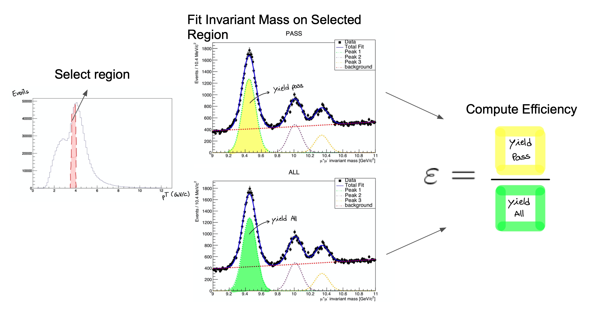
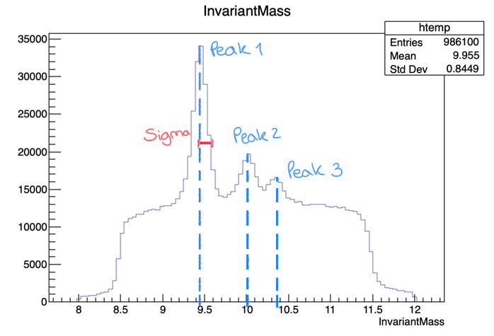

## Prerequisite

To prepare for this tutorial, clone the respective github repository to you "Não faço idea para onde tem de ser copiado este repositório"

~~~
git clone git://github.com/AthomsG/CMS-tutorial
~~~
{: .language-bash}

<h3>A brief explanation of this repository</h3>
The repository you'll use only requires you to make changes on the ``Efficiency.C`` macro. These changes are highligthed as such:

~~~
/*-----------------------------------I N S E R T    C O D E    H E R E-----------------------------------*/
~~~
{:  .language-cpp}

So when you see this comment, know that it's your turn to code!
If you don't, the macro won't run and the follwoing errors are to be expected:

~~~
In file included from input_line_11:1:
/Users/thomasgaehtgens/Desktop/CMS-tutorial/Efficiency.C:13:23: error: expected expression
    bool DataIsMC   = ... ;
                      ^
/Users/thomasgaehtgens/Desktop/CMS-tutorial/Efficiency.C:15:23: error: expected expression
    string MuonId   = ... ;
                      ^
/Users/thomasgaehtgens/Desktop/CMS-tutorial/Efficiency.C:17:23: error: expected expression
    string quantity = ... ; //Pt, Eta or Phi
                      ^
/Users/thomasgaehtgens/Desktop/CMS-tutorial/Efficiency.C:25:22: error: expected expression
    double bins[] = {...};
                     ^
/Users/thomasgaehtgens/Desktop/CMS-tutorial/Efficiency.C:26:21: error: expected expression
    int bin_n     = ...;
                    ^
/Users/thomasgaehtgens/Desktop/CMS-tutorial/Efficiency.C:33:35: error: expected expression
    init_conditions[0] = /*peak1*/;
                                  ^
/Users/thomasgaehtgens/Desktop/CMS-tutorial/Efficiency.C:34:35: error: expected expression
    init_conditions[1] = /*peak2*/;
                                  ^
/Users/thomasgaehtgens/Desktop/CMS-tutorial/Efficiency.C:35:35: error: expected expression
    init_conditions[2] = /*peak3*/;
                                  ^
/Users/thomasgaehtgens/Desktop/CMS-tutorial/Efficiency.C:36:35: error: expected expression
    init_conditions[3] = /*sigma*/;
~~~
{: .error}
    
## The Fitting Method

First, a brief explanation of the method we’ll be studying. 
It consists in fitting the invariant mass of the tag & probe pairs, in the two categories: passing probes, and all probes. 
The fit allows to statistically discriminate between signal and background. To compute the efficiency we simply divide the signal yield from the fits to the Passing category by the signal yield from the fit the inclusive (All) category. This procedure is applied after splitting the dataset in bins of a kinematic variable of the probe (e.g. the traverse momentum); as such, the efficiency will be measured as a function of that quantity for each of the bins.
As mentioned in the [introduction episode](https://cms-opendata-workshop.github.io/workshop-lesson-tagandprobe/01-introduction/index.html) calculating efficiencies is of great importance since _"The determination of the detector efficiency is a critical ingredient in any physics measurement. It accounts for the particles that were produced in the collision but escaped detection (did not reach the detector elements, were missed by the reconstructions algorithms, etc)."_

The following image illustrates the fitting method procedure.



Let's start exploring our dataset. From the cloned directory, type:

~~~
cd DATA/Upsilon/trackermuon
root T\&P_UPSILON_DATA.root
~~~
{: .language-bash}

If everything's right, you should get the following output:
~~~
Attaching file T&P_UPSILON_DATA.root as _file0...
U(TFile *) 0x7fe2f34ca270
~~~
{: .output}
Remember that the units of the x axis are GeV/c.

Now, before we start fitting the invariant mass it's important to look at it's shape first. To visualize our data's invariant mass, do:

~~~
UPSILON_DATA->Draw("InvariantMass")
~~~
{: .language-bash}


If you got the previous result, we're ready to go.

The dataset used in this exercise has been collected by the CMS experiment, in proton-proton collisions at the LHC. It contains 986100 entries (muon pair candidates) with an associated invariant mass. For each candidate, the transverse momentum (pT), rapidity(\eta) and asymuthal angle (\phi) are stored, along with a binary flag, **PassingProbeTrackingMuon** (that is 1 in case the corresponding probe satisfied theTracker Muon selection criteria and 0 in case it doesn't).

| UPSILON_DATA |
 ------------- |
| InvarianMass |
| PassingProbeTrackingMuon | 
| ProbeMuon_Pt |
| ProbeMuon_Eta |
| ProbeMuon_Phi|

We'll start by calculating the efficiency as a function of pT.
It is useful to have an idea of the distribution of the quantity we want to study. In order to do this, we’ll repeat the steps perviously used to plot the invariant mass, but now for the **ProbeMuon_Pt** variable.

~~~
UPSILON_DATA->Draw("ProbeMuon_Pt")
~~~
{: .language-bash}


Hmm.. seems like our domain is larger than we need it to be. To fix this, we can apply a constraint to our plot. Try:

~~~
UPSILON_DATA->Draw("ProbeMuon_Pt", "ProbeMuon_Pt < 20")
~~~
{: .language-bash}


Now that you're acquainted with the data, open the  `Efficiency.C` file. 
You'll have to make some small adjustments to the code in this section ( from line:19 to line:32 ):

~~~
/*-----------------------------------I N S E R T    C O D E    H E R E-----------------------------------*/
double bins[] =  ...;
int bin_n     =  ...;
 /*------------------------------------------------------------------------------------------------------*/


//Now we must choose initial conditions in order to fit our data
double *init_conditions = new double[4];
/*-----------------------------------I N S E R T    C O D E    H E R E-----------------------------------*/
init_conditions[0] = /*peak1*/;
init_conditions[1] = /*peak2*/;
init_conditions[2] = /*peak3*/;
init_conditions[3] = /*sigma*/;
/*------------------------------------------------------------------------------------------------------*/
~~~
{: .language-cpp}

We'll start by choosing the desired bins for the transverse momentum. If you're feeling brave, choose appropriate bins for our fit remembering that we need a fair amount of data in each bin (more events mean a better fit!). If not, we've left  a suggestion that you can paste onto the ```Efficiency.C``` file.

> ## Bin Suggestion
> ~~~
> // TRACKER MUON BINS -------------------------------------------------------------------
>//double bins[] = {2, 3.4, 4, 4.2, 4.4, 4.7, 5.0, 5.1, 5.2, 5.4, 5.5, 5.6, 5.7, 5.8, 5.9, 6.2, 6.4, 6.6, 6.8, 7.3, 9.5, 13.0, 17.0, 40};
>//int bin_n = 23;       //-- BINS USED TO CALCULATE PT
> ~~~
> {: .language-cpp}
>
{: .solution}

Now that the bins are set, we'll need to define the initial parameters for our fit.
You can try to get a good 1st approximation from the plot of the invariant mass that we got before:



or use the suggested values

> ## Suggestion for the Initial Values
>Try the following initial values:
> 
><ul>
><li>init_conditions[0] = 9.46030;</li>
><li>init_conditions[1] = 10.02326;</li>
><li>init_conditions[2] = 10.3552;</li>
><li>init_conditions[3] = 0.08;</li>
></ul>
>
> 
{: .solution}

We are now ready to execute the fits!

## The Fit

We used a gaussian and a crystall ball function for the fist peak (1S) and a gaussian for the remaining peaks. For the background we used a chebychev polynomial.
The fits in this tutorial will be executed using the `/src/DoFit.cpp` function based on the [RooFit](https://root.cern.ch/doc/master/group__Roofit.html) library.

You can find generic tutorials [_here_](https://root.cern.ch/doc/master/group__tutorial__roofit.html).
and if you’re starting with **RooFit** you may find [_this one_ ](https://indico.scc.kit.edu/event/31/contributions/1864/attachments/1105/1550/lukas_hehn_kseta-workshop_introduction-to-RooFit.pdf) particularly useful.

You won't need to do anything in ``DoFit.cpp`` but you can check it out if you're curious. 

> ## Check out `DoFit.cpp`
>The code here is presented in smaller "digestible" chunks, so it's easier to understand.
>
>We begin by linking our dataset to a usable object ( the [**TTree**](https://root.cern.ch/doc/v612/classTTree.html) ) and by creating a [**TCanvas**](https://root.cern.ch/doc/master/classTCanvas.html) to store the fit plots.
>
>we then define a few [**RooRealVar**](https://root.cern.ch/doc/master/classRooRealVar.html) and [**RooFormulaVar**](https://root.cern.ch/doc/master/classRooFormulaVar.html) objects will be used to select the bin associated to the **string** ```condition``` (i.e. "ProbeMuon_Pt > 10 && ProbeMuon_Pt < 10"). After spliting the original dataset, the resulting two [**RooDataSet**](https://root.cern.ch/doc/master/classRooDataSet.html) are used to create two binned [**RooDataHist**](https://root.cern.ch/doc/master/classRooDataHist.html) in which we'll perform the fits.
> ~~~
> double* doFit(string condition, string MuonID_str, string quant, double* init_conditions, bool save = true)
>{
>     TFile *file0    = TFile::Open("DATA/Upsilon/trackerMuon/T&P_UPSILON_DATA.root");
>     TTree *DataTree = (TTree*)file0->Get(("UPSILON_DATA"));
>
>     TCanvas* c_all  = new TCanvas;
>     TCanvas* c_pass = new TCanvas;
>     
>     RooRealVar MuonID(MuonID_str.c_str(), MuonID_str.c_str(), 0, 1); //Muon_Id
>     
>     RooRealVar InvariantMass("InvariantMass", "InvariantMass", 9, 10.8);
>     RooPlot *frame = InvariantMass.frame(RooFit::Title("Invariant Mass"));
>     
>     double* limits = new double[2];
>     if (quant == "Pt") {
>         limits[0] = 0;
>         limits[1] = 40;
>     }
>     if (quant == "Eta") {
>         limits[0] = -3;
>         limits[1] = 3;
>     }
>     if (quant == "Phi") {
>         limits[0] = -2;
>         limits[1] = 2;
>     }
>     RooRealVar quantity(("ProbeMuon_" + quant).c_str(), ("ProbeMuon_" + quant).c_str(), limits[0], limits[1]);
>     
>     RooFormulaVar* redeuce = new RooFormulaVar("PPTM", condition.c_str(), RooArgList(quantity));
>     RooDataSet *Data_ALL    = new RooDataSet("DATA", "DATA", DataTree, RooArgSet(InvariantMass, MuonID, quantity),*redeuce);
>     RooFormulaVar* cutvar = new RooFormulaVar("PPTM", (condition + " && " + MuonID_str + " == 1").c_str() , RooArgList(MuonID, quantity));
> 
>     RooDataSet *Data_PASSING = new RooDataSet("DATA_PASS", "DATA_PASS", DataTree, RooArgSet(InvariantMass, MuonID, quantity), *cutvar);//
>
>     RooDataHist* dh_ALL     = Data_ALL->binnedClone();
>     RooDataHist* dh_PASSING = Data_PASSING->binnedClone();
>     
>~~~
>{: .language-cpp}
>
>We then create the variables used as parameters in the fit. **a0** and **a1** used in the Chebychev polynomial ([**RooChebychev**](https://root.cern.ch/doc/master/classRooChebychev.html), for the background
>and **sigma**, **mean1**,  **mean2**,  **mean3** used on the [**RooCBShape**](https://root.cern.ch/doc/master/classRooCBShape.html) and [**RooGaussian**](https://root.cern.ch/doc/master/classRooGaussian.html) for the signal. **frac1** and **frac2** are used as normalization values.

For the yields of the fits, 
>
>~~~
>     // BACKGROUND VARIABLES
>     RooRealVar a0("a0", "a0", 0, -10, 10);
>     RooRealVar a1("a1", "a1", 0, -10, 10);
> 
>     // BACKGROUND FUNCTION
>     RooChebychev background("background","background", InvariantMass, RooArgList(a0,a1));
>     
>     // GAUSSIAN VARIABLES
>     RooRealVar sigma("sigma","sigma",init_conditions[3]);
>     RooRealVar mean1("mean1","mean1",init_conditions[0]);
>     RooRealVar mean2("mean2","mean2",init_conditions[1]); =(    RooRealVar mean3("mean3","mean3",init_conditions[2]);>.0    // CRYSTAL BALL VARIABLES
>     RooRealVar alpha("alpha","alpha", 1.4384e+00); =(    RooRealVar n("n", "n", 1.6474e+01);>.0    // FIT FUNCTIONS
>     RooCBShape  gaussian1("signal1","signal1",InvariantMass,mean1,sigma, alpha, n); =(    RooGaussian gaussian2("signal2","signal2",InvariantMass,mean2,sigma);>.0    RooGaussian gaussian3("signal3","signal3",InvariantMass,mean3,sigma);
>
>     RooRealVar frac1("frac1","frac1",7.1345e-01);
>     RooRealVar frac2("frac2","frac2",1.9309e-01);    
>
>     double n_signal_initial1 =(Data_ALL->sumEntries(TString::Format("abs(InvariantMass-%g)<0.015",init_conditions[1]))-Data_ALL->sumEntries(TString::Format("abs(InvariantMass-%g)<0.030&&abs(InvariantMass-%g)>.015",init_conditions[1],init_conditions[1]))) / Data_ALL->sumEntries();
>     double n_signal_initial2 =(Data_ALL->sumEntries(TString::Format("abs(InvariantMass-%g)<0.015",init_conditions[2]))-Data_ALL->sumEntries(TString::Format("abs(InvariantMass-%g)<0.030&&abs(InvariantMass-%g)>.015",init_conditions[2],init_conditions[2]))) / Data_ALL->sumEntries();
>     double n_signal_initial3 =(Data_ALL->sumEntries(TString::Format("abs(InvariantMass-%g)<0.015",init_conditions[3]))-Data_ALL->sumEntries(TString::Format("abs(InvariantMass-%g)<0.030&&abs(InvariantMass-%g)>.015",init_conditions[3],init_conditions[3]))) / Data_ALL->sumEntries();
>     
>     double n_signal_initial_total = n_signal_initial1 + n_signal_initial2 + n_signal_initial3;
>     
>     double n_back_initial = 1. - n_signal_initial1 - n_signal_initial2 -n_signal_initial3;
>     
>     RooRealVar n_signal_total("n_signal_total","n_signal_total",n_signal_initial_total,0.,Data_ALL->sumEntries());
>     RooRealVar n_signal_total_pass("n_signal_total_pass","n_signal_total_pass",n_signal_initial_total,0.,Data_PASSING->sumEntries());
>     
>     RooRealVar n_back("n_back","n_back",n_back_initial,0.,Data_ALL->sumEntries());
>     RooRealVar n_back_pass("n_back_pass","n_back_pass",n_back_initial,0.,Data_PASSING->sumEntries());
>
>~~~
>{: .language-cpp}
>
>~~~
>     RooAddPdf* signal;
>     RooAddPdf* model;
>     RooAddPdf* model_pass;
>     
>     signal      = new RooAddPdf("signal", "signal", RooArgList(gaussian1, gaussian2,gaussian3), RooArgList(frac1, frac2));
>     model      = new RooAddPdf("model","model", RooArgList(*signal, background),RooArgList(n_signal_total, n_back));
>     model_pass = new RooAddPdf("model_pass", "model_pass", RooArgList(*signal, background),RooArgList(n_signal_total_pass, n_back_pass));
>     
>     // SIMULTANEOUS FIT
>     RooCategory sample("sample","sample") ;
>     sample.defineType("All") ;
>     sample.defineType("PASSING") ;
>     
>     RooDataHist combData("combData","combined data",InvariantMass,Index(sample),Import("ALL",*dh_ALL),Import("PASSING",*dh_PASSING));
>     
>     RooSimultaneous simPdf("simPdf","simultaneous pdf",sample) ;
>     
>     simPdf.addPdf(*model,"ALL");
>     simPdf.addPdf(*model_pass,"PASSING");
>     
>     RooFitResult* fitres = new RooFitResult;
>     fitres = simPdf.fitTo(combData, RooFit::Save());
> ~~~
>{: .language-cpp}
>
>~~~
>     // OUTPUT ARRAY
>     double* output = new double[4];
>     
>     RooRealVar* yield_ALL = (RooRealVar*) fitres->floatParsFinal().find("n_signal_total");
>     RooRealVar* yield_PASS = (RooRealVar*) fitres->floatParsFinal().find("n_signal_total_pass");
>     
>     output[0] = yield_ALL->getVal();
>     output[1] = yield_PASS->getVal();
>     
>     output[2] = yield_ALL->getError();
>     output[3] = yield_PASS->getError();
>
>     
>     frame->SetTitle("ALL");
>     frame->SetXTitle("#mu^{+}#mu^{-} invariant mass [GeV/c^{2}]");
>     Data_ALL->plotOn(frame);
>     
>     model->plotOn(frame);
>     model->plotOn(frame,RooFit::Components("signal1"),RooFit::LineStyle(kDashed),RooFit::LineColor(kGreen));
>     model->plotOn(frame,RooFit::Components("signal2"),RooFit::LineStyle(kDashed),RooFit::LineColor(kMagenta - 5));
>     model->plotOn(frame,RooFit::Components("signal3"),RooFit::LineStyle(kDashed),RooFit::LineColor(kOrange));
>     model->plotOn(frame,RooFit::Components("background"),RooFit::LineStyle(kDashed),RooFit::LineColor(kRed));
>     
>     c_all->cd();
>     frame->Draw("");
>     
>     RooPlot *frame_pass = InvariantMass.frame(RooFit::Title("Invariant Mass"));
>     
>     c_pass->cd();
>     
>     frame_pass->SetTitle("PASSING");
>     frame_pass->SetXTitle("#mu^{+}#mu^{-} invariant mass [GeV/c^{2}]");
>     Data_PASSING->plotOn(frame_pass);
>     
>     model_pass->plotOn(frame_pass);
>     model_pass->plotOn(frame_pass,RooFit::Components("signal1"),RooFit::LineStyle(kDashed),RooFit::LineColor(kGreen));
>     model_pass->plotOn(frame_pass,RooFit::Components("signal2"),RooFit::LineStyle(kDashed),RooFit::LineColor(kMagenta - 5));
>     model_pass->plotOn(frame_pass,RooFit::Components("signal3"),RooFit::LineStyle(kDashed),RooFit::LineColor(kOrange));
>     model_pass->plotOn(frame_pass,RooFit::Components("background"),RooFit::LineStyle(kDashed),RooFit::LineColor(kRed));
>     
>     frame_pass->Draw();
> 
>     if(save)
>     {
>         c_pass->SaveAs(("Fit Result/" + condition + "_ALL.pdf").c_str());
>         c_all->SaveAs (("Fit Result/" + condition + "_PASS.pdf").c_str());
>     }
>         
>     // DELETING ALLOCATED MEMORY
>     delete[] limits;
>     //
>     delete file0;
>     //
>     delete Data_ALL;
>     delete Data_PASSING;
>     //
>     delete dh_ALL;
>     delete dh_PASSING;
>     //
>     delete cutvar;
>     delete redeuce;
>     //
>     delete signal;
>     //
>     delete c_all;
>     delete c_pass;
>     //
>     delete model;
>     delete model_pass;
>    delete fitres;
>    
>    return output;
>}
> ~~~
> {: .language-cpp}
>
>
>
>
>
> 
{: .solution}


Now we only need to create a loop to fit each bin and save the yields and associated errors in order to get the efficiency. This is achieved by:

~~~
for (int i = 0; i < bin_n; i++)
{
    if (DataIsMC)
        yields_n_errs[i] = McYield(conditions[i]);
    else
        yields_n_errs[i] = doFit(conditions[i], "PassingProbeTrackerMuon", init_conditions);
}
~~~
{:  .language-cpp}
The ```McYield``` function has the same output as ```DoFit``` and has to do with Monte Carlo dataset, which only contains signal for the 1S peak.

To get the efficiency plot, we'll use the [TEfficiency](https://root.cern.ch/doc/master/classTEfficiency.html)  class.
You'll see that in order to create a ``TEfficiency`` object, one of the [constructors required](https://root.cern.ch/doc/master/classTEfficiency.html#aa0e99b4161745fd3bee0ae5c0f58880e) requires two ``TH1``objects. One with _All_ the probes and one with the _Passing_ probes.

> ## Important note
>You musn't forget to add the fitting errors to the yield histograms. Using ``/src/make_hist.cpp``  will guarantee that the errors are included.
> 
{: .callout}

The creation of these ``TH1`` objects is taken care of by the ``/src/make_hist.cpp`` function.

> ## Open `make_hist.cpp`
>
> ~~~
> double* doFit(string condition, string MuonID_str, double* init_conditions, bool save = TRUE) // RETURNS ARRAY WITH [yield_all, yield_pass, err_all, err_pass]    ->   OUTPUT ARRAY
>{
>    TH1F* make_hist(string name, double** values, int qnt, int bin_n, Double_t* binning, bool IsDataMc, bool DRAW = FALSE)
>    {
>        TH1F* hist = new TH1F(name.c_str(), name.c_str(), bin_n, binning);
>
>        for (int i = 0; i < bin_n; i++)
>        {
>            hist->SetBinContent(i, values[i][qnt]);
>            if (IsDataMc == FALSE)
>                hist->SetBinError(i, values[i][qnt+2]);
>        }
>        if (DRAW)
>        {
>            TCanvas* xperiment = new TCanvas;
>            xperiment->cd();
>            hist->Draw();
>        }
>        return hist;
>    }
>}
> ~~~
> {: .language-cpp}
>
> 
{: .solution}

To plot the efficiency we'll the use the ``/src/get_efficiency.cpp`` function.

> ## Open `get_efficiency.cpp`
>
> ~~~
>TEfficiency* get_efficiency(TH1F* ALL, TH1F* PASS)ID_str, double* init_conditions, bool save = TRUE) // RETURNS ARRAY WITH [yield_all, yield_pass, err_all, err_pass]    ->   OUTPUT ARRAY
>{
>    TFile* pFile = new TFile("Efficiency_Run2011.root","recreate");lues, int qnt, int bin_n, Double_t* binning, bool IsDataMc, bool DRAW = FALSE)
>    TEfficiency* pEff = new TEfficiency();
>    pEff->SetName("Efficiency");name.c_str(), bin_n, binning);
>
>    pEff->SetPassedHistogram(*PASS, "f");
>    pEff->SetTotalHistogram (*ALL,"f");
>    [qnt]);
>    pEff->SetDirectory(gDirectory);
>    pFile->Write();i][qnt+2]);
>    
>    TCanvas* oi = new TCanvas();
>    oi->cd();
>    pEff->Draw();;
>    
>    gPad->Update();
>
>    //Set range in y axis
>
>    auto graph = pEff->GetPaintedGraph();
>    graph->SetMinimum(0.8);
>    graph->SetMaximum(1.2);
>    gPad->Update();
>  
>    return pEff;
>}
> ~~~
> {: .language-cpp}
>
> 
{: .solution}

to run your code, type:
~~~
root Efficiency.C -q
~~~
{: .language-bash}

when the macro stops doing its thing, you should have 2 new files. One on your working directory: ```Histograms.root```, and another one ```Efficiency_Run2011.root``` located at ```/Efficiency Result/Pt```.
The second contains the efficiency we calculated! the first file is used to redo any unusable fits.
To open ``Efficiency_Run2011.root``, on your working directory type:

~~~
root
new TBrowser
~~~
{: .language-bash}


A window like this should have popped up.
If you click on ``Efficiency_Run2011.root``, a plot will show up with the efficiency value for each bin!

Now we must re-run the code, but before that, change ``DataIsMc`` value to **TRUE**. This will generate an efficiency for the simulated data, so that we can compare it with the 2011 run.

Check that you have both ```Efficiency_Run2011.root``` and ```Efficiency_MC.root``` files in each of these directories:

<ul>
<li>Efficiency Result/pT</li>
<li>Efficiency Result/Eta</li>
<li>Efficiency Result/Phi</li>
</ul>

If so, uncomment:

~~~
//compare_efficiency(quantity, "Efficiency_Result/Pt/Efficiency_Run2011.root", "Efficiency_Result/Pt/Efficiency_MC.root");
~~~
{: .language-cpp}

and run the macro again.
You should get something like the following result. If so, repeat this process for the two quantites left to go, Eta and Phi!
In case you want to change on of the fits, use the ```change_bin.cpp```function.


> ## Extra challenge
>
> Fancy some more work? download [this](https://drive.google.com/drive/folders/1YytJ7iTVYToUZemYIDLqr13wTjIYGERP?usp=sharing) J/ψ dataset and try out the new methods you just learned!
>You'll have to change the DoFit.cpp function since J/ψ's only peak is made up of a crystall ball and a gaussian curve.
>Good luck!
{: .challenge}


